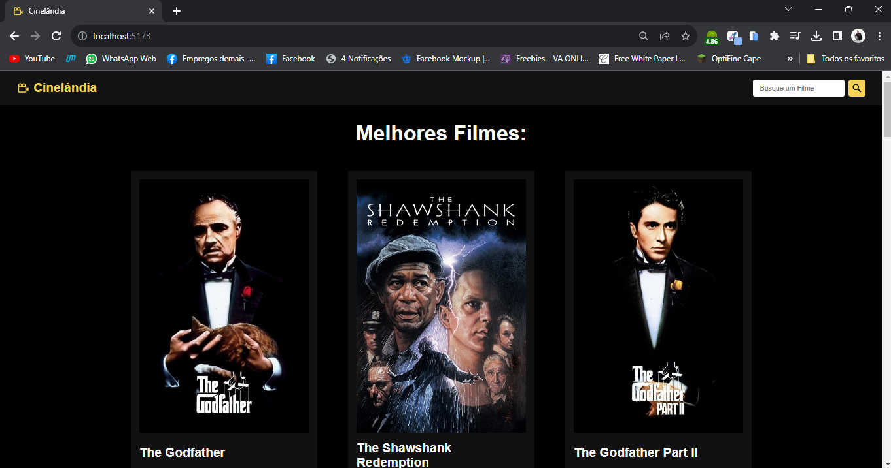

# Cinelândia: Tudo sobre filmes! 📽️


# Sobre o projeto ℹ️

Link do Projeto Funcionando: https://cinelandia-alpha.vercel.app/

Aplicação real desenvolvida para portifólio.<br>
<br>A aplicação consiste em um site que lista todos os filmes em cartaz no cinema, organizados por avaliação. É possível pesquisar por nome, ver a avaliação, o orçamento e outros detalhes que interessam aos "forumeiros".

## Layout 🖌️


# Funcionalidades ⚙️
* Integração com a API
* Input de Pesquisa
* Grid de Filmes
* Página individual de detalhes (orçamento, receira, duração, slogan e descrição)


# Componentes ⚙️
* Home
* Navbar
* MoviesGrid
  
## API Utilizada ⚙️
- TMDB (themoviedb)
- Link da Documentação: ([**Clique Aqui!**](https://developer.themoviedb.org/reference/intro/getting-started))

# Tecnologias utilizadas 🧑🏾‍💻
- HTML / CSS / JS / 
- ReactJS
  
## Bibliotecas (Dependências) 🧑🏾‍💻
- react-icons: ^4.12.0
- react-router-dom: ^6.18.0


# Como executar o projeto 💡

Pré-requisitos: npm

```bash
# clonar repositório
git clone https://github.com/fdfborges/cinelandia

# entrar na pasta do projeto front-end web
cd Cinelandia

# instalar as dependências
npm install

# executar o projeto
npm run dev
```

# Autor
Feito com ❤️ por Felipe Borges.
https://www.linkedin.com/in/fdfborges/
